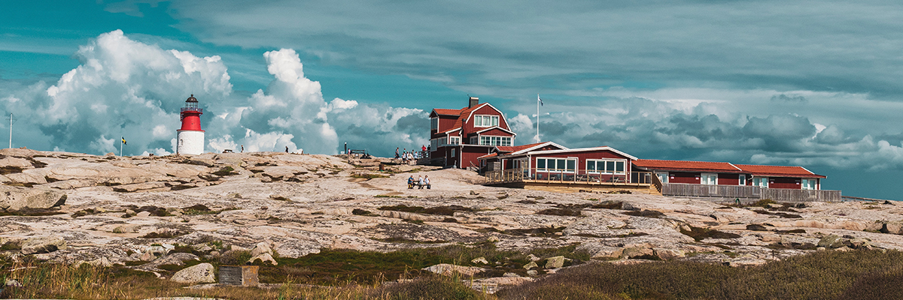

> 🇸🇪 A practical, life & setup guide for moving to Sweden

---
 

## ✈️ Before Arrival & Universal First Steps (All cities & universities)
- **Residence permit & long-term residence status**  
  - [SULF guide](https://sulf.se/en/work-salary-and-benefits/residence-permit/residence-permit/)  
  - [Migration webinar for PhDs & researchers](https://sulf.se/sulf-play/doktorand/webinar-the-enquiry-about-migration-rules-for-doctoral-candidates-and-researchers/)

- **Personnummer & ID card**
  - Mandatory everywhere.
  - You must first apply for your personnummer at Skatteverket as soon as you arrive. Bring required docs (passport, residence permit, etc.)
  - Once you receive your personnummer, then you can apply for your Swedish ID card.
  - Without these two (personnummer + ID card), you cannot open a full bank account, get BankID, or properly register for many services (including unions, insurance, etc.).
  - Online pre-registration: [Move to Sweden form](https://www7.skatteverket.se/portal/flytta-till-sverige-anmalan/skapa/bakgrund)
  - ID card booking: [Book here](https://ssc.nemoq.se/Booking/Booking/Index/SSC)
  - General procedure:
    - Book a visit or walk in to Skatteverket.
    - Submit your application for personnummer with all required docs (passport, residence permit, marriage/birth certificates if applicable, employment/admission letter).
    - Wait 2–5 weeks to receive your personnummer letter by mail.
    - After getting your personnummer, book a separate appointment for the ID card: [Book here](https://ssc.nemoq.se/Booking/Booking/Index/SSC).
    - Bring your personnummer letter and residence permit card to the appointment.
    - Wait 1–3 weeks to receive your ID card by mail.

- **Bank account & BankID**
  - Open your account with personnummer + ID. Ask for Swish and BankID on day one.
  - Each bank has different requirements and procedures. Some want extra documentation (like proof of employment or a tax decision letter), and some might even do a short interview.
  - You'll probably have to book an appointment and wait in a queue (get used to queues — you'll see them everywhere in Sweden, and this README won't be the last time you hear about them).
  - General procedure:
    - Open your bank account (requires personnummer + ID card).
    - Request BankID and Swish setup (can usually be done same day as account opening, if approved).
    - Wait to receive your debit card (MasterCard/Visa) by post — usually 1 week.
    - Wait for a separate letter with your card PIN code — usually another week.
  - Without BankID, you can't use most digital services, including e-identification, Swish, many online payments, and even some university systems.
  - While waiting, use **Revolut** or get help from local friends.

- **Forsakringskassan (insurance) registration**
  - Mandatory for healthcare and social benefits.  
  - [Forsakringskassan guide](https://www.forsakringskassan.se/privatperson/flytta-till-arbeta-i-studera-i-eller-vara-nyanland-i-sverige/flytta-till-sverige)
  - Order EU health card if needed.

- **Medical registration**
  - Register at a local "vårdcentral" via [1177.se](https://www.1177.se/).
  - Start appointments there; 1177 is also your first phone contact for urgent care.

## 🏡 Housing

### General (All cities)
- **Long-term rentals & queues**
  - [HomeQ](https://www.homeq.se/) — covers many cities (Stockholm, Gothenburg, Malmö, Norrköping, Linköping).
  - [Boplats](https://nya.boplats.se/) — Gothenburg only.
  - [HSB](https://www.hsb.se/) — mainly Gothenburg, but some properties in other regions; check local HSB branch.
  - [Kjellberg](https://kjellberg.se/) — Gothenburg only.
  - [Wallenstam](https://www.wallenstam.se/) — mostly Gothenburg & Stockholm.

- **Second-hand / sublets**
  - [Blocket](https://www.blocket.se/)
  - [Samtrygg](https://www.samtrygg.se/)
  - [Qasa](https://qasa.se/sv/)

- **Short-term guest houses**
  - [Företagsbostäder](https://www.foretagsbostader.se/) — available in several major cities, check specific city pages.
  - [WOW Apartments](https://www.wowapartments.se/) — Gothenburg only.
  - [Waterfront Cabins](https://en.waterfrontcabins.se/) — Gothenburg only.
  - [BEAPS](https://beaps.se/) — mostly Gothenburg.

- **Buying a house**
  - [Hemnet](https://www.hemnet.se/)
  - [Booli](https://www.booli.se/)
  - Agencies: Bjurfors, Fastighetsbyrån, Erik Olsson, etc.

### University & City-specific housing

#### Gothenburg (Chalmers & GU)
- SGS Student Housing: [sgs.se](https://sgs.se/)
- Chalmers Studentbostäder: [chalmersstudentbostader.se](https://www.chalmersstudentbostader.se/en/)
- Guest house options: ask your department coordinator.

#### Stockholm (KTH, SU, KI)
- SSSB (Student housing): [sssb.se](https://www.sssb.se/)
- University guest houses or housing offices.

#### Lund (LU)
- LU Accommodation: [lu.se](https://www.lunduniversity.lu.se/student-life/housing/lu-accommodation)
- AF Bostäder: [afbostader.se](https://www.afbostader.se/)

#### Uppsala (UU)
- Uppsala University housing: [uu.se](https://www.uu.se/en/about-uu/join-us/plan-your-stay/accommodation)

#### Umeå (UMU)
- Umeå University housing: [umu.se](https://www.umu.se/en/education/accommodation/)
- Umeå Bostaden: [bostaden.umea.se](https://www.bostaden.umea.se/)

## 💰 Finance & Admin
- **Tax declaration (Skatteverket)**
  - Review your first-year declaration carefully; possible revision needed.
  -  Useful video guides
      - [How Much Tax Do You REALLY Pay in Sweden?](https://youtu.be/gmBR7utRykc)
      - [Taxes in Sweden | Skattedeklaration | Tax Returns](https://youtu.be/3ib7GAMufvk)
      - [HOW THE TAX RETURN WORKS IN SWEDEN](https://youtu.be/5chD7fqtjPY)

- **Insurance & unions**
  - Home insurance is a must.
  - Unions: SULF, A-kassa, and student unions — recommended for support and legal help.

- **Pension planning & mortgages**
  - **Pension**  
    - In Sweden, pensions have three parts: public pension, occupational pension, and private savings.
    - Researchers usually get an occupational pension via their university but might need private savings to reach ~60–80% final salary (default is ~30–50%).
    - [SULF guide on pensions for researchers](https://sulf.se/en/work-salary-and-benefits/pension/)
    - [Min Pension official planner](https://www.minpension.se/)
  - **Mortgages**
    - Banks typically lend up to 4.5× your annual gross income.
    - Max 85% of property value is covered; 15% minimum down payment required.
    - Permanent residence or stable employment can help secure better terms.

## 🏥 Health & Work ergonomics
- **Vårdcentral & 1177 registration**: mandatory in all cities.
- **Medication lookup**: [FASS](https://www.fass.se/LIF/startpage)

### University-specific 
- **Chalmers**
  - Terminal glasses only covered, via Synoptik.
  - Glasses remain Chalmers property after contract ends.

## 👨‍👩‍👧‍👦 Family & legal
Processes like inviting family or friends (visitor visa), permanent residence, citizenship, marriage or sambo agreements, and other legal steps depend heavily on nationality and personal status. 

👉 We'll update and expand this section with detailed checklists and links soon. Stay tuned.

## 📱 Essential apps

###  General (nationwide)
- **Swish** — [Web](https://www.swish.nu/) / [iOS]() / [Android]()
- **BankID** — [Web](https://www.bankid.com/en/) / [iOS]() / [Android]()
- **Kivra** — [Web](https://kivra.se/sv/privat/) / [iOS]() / [Android]()
- **Mecenat (student discounts)** — [Web](https://mecenat.com/se) / [iOS]() / [Android]()
- **Revolut** — [Web](https://www.revolut.com/) / [iOS]() / [Android]()
- **Klarna** — [Web](https://www.klarna.com/se/) / [iOS]() / [Android]()
- **Avanza (investments)** — [Web](https://www.avanza.se/start) / [iOS]() / [Android]()
- **Foodora** — [Web](https://www.foodora.se/) / [iOS]() / [Android]()
- **Wolt** — [Web](https://wolt.com/sv) / [iOS]() / [Android]()
- **Uber** — [Web](https://www.uber.com/se/en/) / [iOS]() / [Android]()
- **Bolt** — [Web](https://bolt.eu/en/) / [iOS]() / [Android]()
- **Voi (e-scooter)** — [Web](https://www.voi.com/) / [iOS]() / [Android]()
- **AllTrails (hiking)** — [Web](https://www.alltrails.com/) / [iOS]() / [Android]()
- **EasyPark** — [Web](https://www.easypark.com/sv-se) / [iOS]() / [Android]()
- **Yr (weather)** — [Web](https://www.yr.no/) / [iOS]() / [Android]()
- **SOS Alarm 112** — [Web](https://www.sosalarm.se/) / [iOS]() / [Android]()

### Gothenburg
- **Västtrafik To Go** — [Web](https://www.vasttrafik.se/) / [iOS]() / [Android]()

### Stockholm
- **SL (public transport)** — [Web](https://sl.se/) / [iOS]() / [Android]()

### Lund / Skåne
- **Skånetrafiken** — [Web](https://www.skanetrafiken.se/) / [iOS]() / [Android]()

### Uppsala
- **UL (Uppland public transport)** — [Web](https://www.ul.se/) / [iOS]() / [Android]()

## Final words
Coming to a new country always brings its own challenges, and Sweden has its share of bureaucracy. Hopefully, this guide gives you some useful hints and helps you avoid surprises. Rule of thumb: don't delay your paperwork — waiting too long often leads to even longer queues and unnecessary headaches later. Just start, step by step, and you'll be fine.

### ✉️ Contributions
Did you learn something new? [Help update this guide for the next wave of newcomers](./CONTRIBUTING.md).
